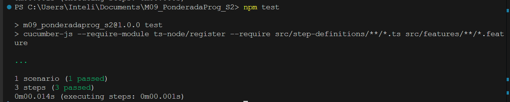
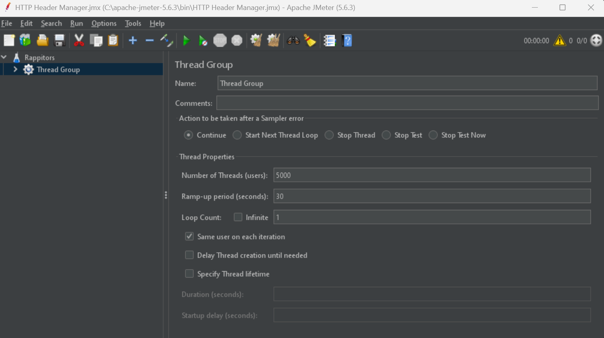
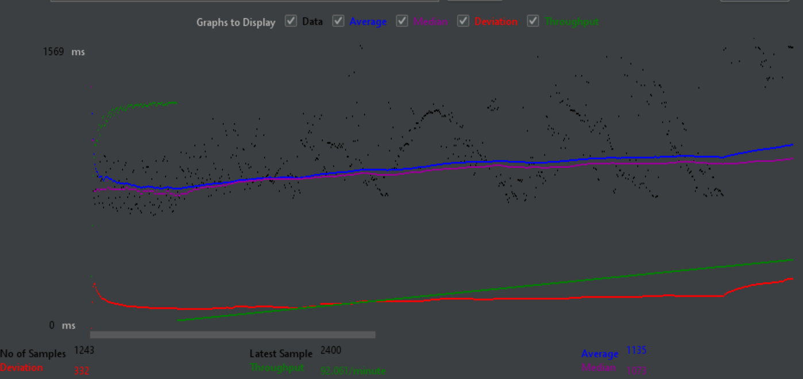

# Ponderada de Programação

Módulo 09 - Semana 01

## Transformação de Regras de Negócio em Código e Verificação de Qualidade

Kaiane Souza Cordeiro - Engenharia de Software (turma 09)

&emsp;&emsp;Nesta atividade, vou transformar as necessidades do negócio em código e validar as regras através de testes. Começarei criando um mapa dos *business drivers*, identificando problemas e suas soluções. Em seguida, vou definir uma estratégia de testes utilizando ferramentas como Cucumber com Gherkin para testar as regras de negócio e JMeter para avaliar a performance do sistema. Por fim, farei a análise dos códigos e dos resultados dos testes para garantir que as regras estão sendo seguidas e que a qualidade do sistema está sendo mantida.

## 1. Mapa dos Business Drivers

O mapa dos *business drivers* é uma ferramenta que conecta as necessidades e desafios do negócio com as regras de negócio que devem ser implementadas no sistema. Ele ajuda a identificar as dores ou erros que impactam o desempenho ou a experiência do usuário e, a partir disso, cria soluções por meio da definição de regras claras.

Aqui está a tabela com alguns exemplos de como mapear os drivers:

| Dores e Erros                              | Regra de Negócio (Definição)                                     | Indicador de Conformidade                         | Direcionador (foco)                                                                 |
|--------------------------------------------|------------------------------------------------------------------|--------------------------------------------------|------------------------------------------------------------------------------------|
| **Erros na exibição dos ganhos dos entregadores** | O valor exibido deve ser igual ao valor calculado                 | Diferença < 0.5% entre UI e cálculo real         | Assegurar transparência nos ganhos dos entregadores, reduzindo solicitações de suporte e aumentando a confiança na plataforma. |
| **Lentidão em algumas telas/etapas**       | O tempo de resposta deve ser aceitável                            | Tempo de carregamento < 2s                        | Melhorar a performance das telas para otimizar a experiência do usuário e reduzir a taxa de abandono. |


### 1.1 Erros na Exibição dos Ganhos dos Entregadores (testado com Gherkin)

**O que é?**  
Este problema ocorre quando os valores exibidos para os entregadores, que mostram os ganhos após a realização das entregas, não coincidem com os cálculos reais realizados pelo sistema. Isso pode gerar confusão entre os entregadores, que podem se sentir desmotivados ao perceberem que o valor mostrado não corresponde ao que de fato foi calculado e devido.

**O que pode ser a causa?**  
- Falhas na lógica de cálculo que gera a exibição dos ganhos.  
- Erros na integração entre o back-end e o front-end.  
- Problemas de sincronização entre os sistemas de pagamento e exibição de dados.  
- Erros de arredondamento ou formatos de exibição incorretos.

**O que afeta?**  
Esse erro afeta diretamente a transparência e a confiança dos entregadores na plataforma, o que pode levar a um aumento no número de solicitações de suporte e até mesmo a uma queda na satisfação e no engajamento dos entregadores. A longo prazo, isso pode resultar em uma perda de competitividade para a plataforma, caso os entregadores não se sintam confiantes em relação ao sistema de pagamentos.

### 1.2 Lentidão em Algumas Telas/Etapas (testado com JMeter)

**O que é?**  
A lentidão em algumas telas ou etapas refere-se ao atraso no tempo de resposta do sistema durante a navegação ou ao carregar informações. Quando os usuários, sejam clientes ou entregadores, interagem com a plataforma, eles esperam uma experiência ágil. Se o tempo de carregamento for elevado, isso pode causar frustração e até mesmo abandono da plataforma.

**O que pode ser a causa?**  
- Consultas ao banco de dados não otimizadas, que demoram para retornar os dados solicitados.  
- Carregamento de recursos pesados nas páginas, como imagens e scripts grandes.  
- Infraestrutura inadequada ou servidores mal configurados.  
- Problemas de rede ou de conexão com a internet. 

**O que afeta?**  
Esse problema afeta diretamente a experiência do usuário, diminuindo a satisfação e a probabilidade de o usuário continuar utilizando a plataforma. Em plataformas como a Rappi, onde a agilidade é crucial, uma lentidão excessiva pode levar a uma taxa de abandono maior e impactar negativamente a percepção do serviço. Isso, por sua vez, pode resultar em uma queda nas vendas e na fidelidade dos usuários, além de aumentar a taxa de desistência durante o processo de compra ou entrega.

## 2. Estratégia e Massa de Testes

### 2.1 Erros na Exibição dos Ganhos dos Entregadores 

#### 📌 **Testes Automatizados com Gherkin e Cucumber**  

Este projeto utiliza **Gherkin** para definir cenários de teste de forma legível e estruturada. O **Cucumber.js** interpreta esses cenários e executa os testes automaticamente.  

##### 📂 **Onde encontrar os arquivos?**  
Os testes seguem a seguinte estrutura:  

```
📁 features/
   ├── exibicao-ganhos-entregadores.feature  # Arquivo Gherkin com os cenários de teste
📁 step-definitions/
   ├── exibicao-ganhos-entregadores.ts  # Implementação dos passos dos testes
📁 SistemaRappi/
   ├── calculo-ganhos-entregadores.ts  # Lógica do cálculo de ganhos
```

##### 📝 **Como funciona?**  
1. O **arquivo `.feature`** contém os cenários de teste escritos em Gherkin, descrevendo a lógica esperada.  
2. O **arquivo de step definitions** implementa cada passo do Gherkin usando TypeScript.  
3. Durante a execução, o **Cucumber** lê os cenários, chama os métodos correspondentes e valida os resultados.  

##### ✅ **Exemplo de Teste (Gherkin)**  
Arquivo: `features/exibicao-ganhos-entregadores.feature`  
```gherkin
Feature: Cálculo de ganhos dos entregadores
  Scenario: Entregador visualiza seus ganhos corretamente
    Given o sistema tem uma lógica de cálculo de ganhos baseada em taxas e entregas realizadas
    When o entregador solicita a exibição dos seus ganhos
    Then o valor exibido deve ser igual ao valor calculado pela lógica do sistema
```

🔹 **Executando os testes**  
Para rodar os testes, utilize o comando:  
```sh
npm test
```


### 2.2 **Lentidão em Algumas Telas/Etapas**

Para essa etapa da análise de qualidade do sistema da Rappi, foi criada uma tabela chamada "entregadores", no [Supabase](https://supabase.com/), que me disponibiliza uma api rest automaticamente:
(aqui eu quero focar em comprovar a hipótese de que maiores volumes de requisições influenciam diretamente no tempo de resposta do sistema).

1. Testando no Jmeter

O Thread Group define o número de usuários virtuais (threads) e a frequência com que as requisições serão feitas. Sendo assim, podem-se especificar os seguintes parâmetros:


Configure:
Number of Threads (Users): Número de requisições simultâneas.
Ramp-Up Period (in seconds): O tempo que o JMeter levará para iniciar todas as threads.
Loop Count: Quantas vezes cada thread realizará a requisição.



### 1. Interpretação do gráfico

   - **Linha Azul (Average)**: Representa o **tempo médio de resposta** das requisições. Neste caso, ela está aumentando de forma constante, o que indica que o sistema está ficando mais lento à medida que o número de requisições aumenta. O valor **1135 ms** é o tempo médio de resposta no final do teste.
   - **Linha Verde (Median)**: A linha verde representa o **tempo mediano** das requisições, ou seja, o tempo que divide as requisições em duas metades: 50% dos tempos de resposta são menores que a mediana e 50% são maiores. A mediana, **1073 ms**, também segue uma tendência de aumento, mas não de forma tão acentuada quanto a média. Isso indica que a maioria das requisições está se comportando de maneira mais consistente, mas ainda assim há uma piora no desempenho.
   - **Linha Vermelha (Deviation)**: A linha vermelha mostra o **desvio padrão** dos tempos de resposta. Um valor **alto de desvio** significa que há uma grande variação nos tempos de resposta das requisições. O valor de **332 ms** sugere que algumas requisições estão levando muito mais tempo para serem processadas do que outras. Isso indica que, além do tempo médio e da mediana subirem, algumas requisições estão enfrentando picos de latência.
   - **Linha Roxa (Throughput)**: A linha roxa mostra o **throughput**, ou seja, a quantidade de requisições processadas por minuto. O valor de **92.061 requisições/minuto** mostra que o sistema está processando um bom número de requisições, mas o throughput está se estabilizando, o que pode indicar que o servidor está chegando ao limite de sua capacidade de processamento.

### 2. Informações do gráfico:
   - **No of Samples (Número de amostras)**: **1243 requisições** foram feitas durante o teste.
   - **Deviation**: O desvio padrão de **332 ms** reflete uma variação significativa no tempo de resposta entre as requisições. Esse é um ponto importante para investigar, pois pode indicar gargalos ou picos de latência em algumas requisições.
   - **Latest Sample**: O tempo de resposta da última requisição foi **2400 ms**, o que é significativamente mais alto do que a média (**1135 ms**) e a mediana (**1073 ms**). Isso sugere que algumas requisições estão levando muito mais tempo para serem processadas.
   - **Average**: O **tempo médio de resposta** ao longo do teste foi **1135 ms**, o que indica uma latência considerável.
   - **Median**: O **tempo mediano de resposta** foi **1073 ms**, o que está um pouco abaixo da média e reflete que a maioria das requisições está tendo um desempenho mais consistente, mas ainda assim com um tempo de resposta elevado.

### O que isso significa?

1. **Aumento do tempo de resposta médio**:
   - O aumento contínuo do tempo de resposta médio (linha azul) ao longo do teste é um sinal claro de que o sistema está ficando sobrecarregado à medida que o número de requisições aumenta. Isso pode ser causado por uma série de fatores, como limitações de hardware, problemas na infraestrutura do servidor ou falhas no código que não estão conseguindo lidar com a carga adequadamente.

2. **Desvio elevado (linha vermelha)**:
   - O desvio alto (linha vermelha) sugere que, além do aumento no tempo médio de resposta, algumas requisições estão sendo muito mais lentas do que outras, o que pode indicar que o servidor está experimentando picos de latência ou que há algum tipo de gargalo específico em algumas partes do sistema.

3. **Throughput estabilizado**:
   - O throughput está estável (aproximadamente **92 requisições/minuto**), mas não parece estar aumentando. Isso indica que o servidor conseguiu atingir um limite de requisições por minuto, o que pode significar que a capacidade do servidor está sendo saturada.

4. **Última requisição muito mais lenta**:
   - O tempo de resposta da última requisição foi **2400 ms**, que é mais de duas vezes maior do que o tempo médio. Isso pode indicar que o servidor não está mais conseguindo processar as requisições com eficiência à medida que a carga aumenta, levando a picos de latência.

### O que fazer a partir daqui?

1. **Investigação de Gargalos**:
   - O aumento do desvio e os tempos elevados de resposta indicam que pode haver um gargalo no servidor. Vale investigar os logs do servidor e monitorar o uso de CPU, memória e outros recursos durante o teste.

2. **Ajuste de Infraestrutura**:
   - Se o sistema estiver alcançando a saturação com esse número de requisições, pode ser necessário escalar a infraestrutura. Isso pode incluir o aumento de recursos do servidor, o uso de balanceamento de carga ou a adoção de uma arquitetura distribuída.

3. **Otimização de Código e Banco de Dados**:
   - Se o servidor está atingindo sua capacidade de processamento, a otimização de partes do código (como consultas ao banco de dados ou operações de IO) pode ajudar a reduzir o tempo de resposta.

### Conclusão:
O gráfico mostra um aumento claro no tempo de resposta e um desvio alto conforme o número de requisições aumenta, indicando que o sistema está sobrecarregado. A próxima etapa seria investigar os motivos dessa lentidão, como limitações de hardware ou gargalos no servidor, e aplicar soluções de escalabilidade ou otimização.

